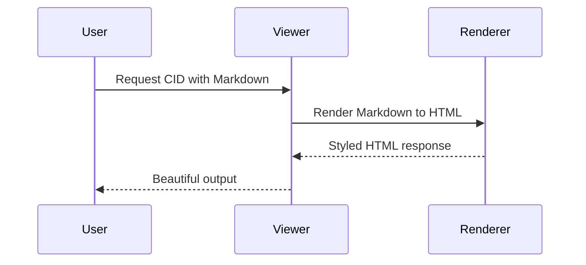

# Markdown Showcase

Welcome to the CID markdown renderer! This document highlights supported features and good authoring patterns.

> **Tip:** Use Markdown to quickly share runbooks, diagrams, and form ideas with your team.

## Headings & Emphasis

Markdown gives you structured sections:

- **Bold** and *italic* text
- Nested lists for checklists
  - [ ] Capture requirements
  - [x] Render Markdown beautifully
- Automatic tables of contents are generated by many editors

## Code & Callouts

```python
from datetime import datetime

print("Rendered at", datetime.now().isoformat())
```

!!! note "Reusable components"
    Wrap snippets in callouts to draw attention to reusable patterns or workflows.

## Data Tables

| Feature             | Syntax example                 |
| ------------------- | ------------------------------ |
| Headings            | `## Section title`             |
| Task list           | `- [ ] Pending item`           |
| Definition list     | `Term` followed by `: Details` |

Term
: Details stay aligned thanks to the definition list extension.

## Images & Embeds




## Form Ideas

```
:::form id="feature-request"
[name] (text, required)
[email] (email)
[priority] (select: low | medium | high)
:::
```

Use a fenced block to sketch future form syntax. It is easy to extend the renderer with custom processors later.

---

Need a quick start? Duplicate this file, adjust the headings, and publish instantly.
